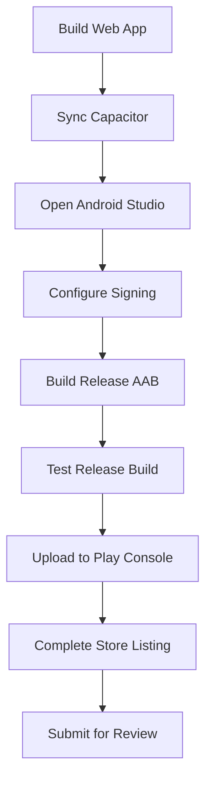
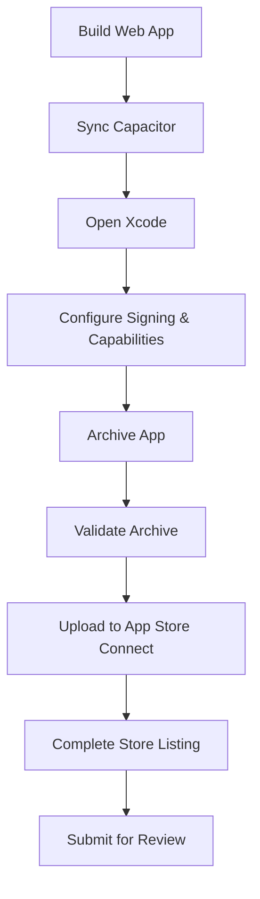

# Design Document

## Overview

This design document outlines the architecture and implementation approach for preparing the Quran application for submission to the Google Play Store and Apple App Store. The application will use Capacitor to bridge the existing React web application into native mobile applications for both iOS and Android platforms.

The design follows a phased approach:
1. **Capacitor Integration**: Install and configure Capacitor framework
2. **Native Project Setup**: Generate and configure platform-specific projects
3. **Asset Preparation**: Create icons, splash screens, and store assets
4. **Mobile Optimization**: Adapt web features for mobile environments
5. **Build & Testing**: Generate and test release builds
6. **Store Preparation**: Prepare submission materials and documentation

## Architecture

### High-Level Architecture

```
┌─────────────────────────────────────────────────────────┐
│                    React Web App                         │
│  (Vite + React + Firebase + Service Worker)             │
└────────────────────┬────────────────────────────────────┘
                     │
                     ▼
┌─────────────────────────────────────────────────────────┐
│              Capacitor Bridge Layer                      │
│  - Web View Container                                    │
│  - Native Plugin APIs                                    │
│  - Platform Communication                                │
└──────────────┬──────────────────────┬───────────────────┘
               │                      │
       ┌───────▼────────┐    ┌───────▼────────┐
       │  Android App   │    │    iOS App     │
       │  (Java/Kotlin) │    │ (Swift/Obj-C)  │
       └────────────────┘    └────────────────┘
               │                      │
       ┌───────▼────────┐    ┌───────▼────────┐
       │  Play Store    │    │   App Store    │
       └────────────────┘    └────────────────┘
```

### Technology Stack

**Core Framework:**
- Capacitor 6.x (latest stable)
- @capacitor/core
- @capacitor/cli

**Platform-Specific:**
- @capacitor/android (Android SDK 22+, targeting latest)
- @capacitor/ios (iOS 13.0+)

**Capacitor Plugins:**
- @capacitor/app (app lifecycle, URL handling)
- @capacitor/splash-screen (splash screen control)
- @capacitor/status-bar (status bar styling)
- @capacitor/network (network status detection)
- @capacitor/filesystem (offline data storage)

**Build Tools:**
- Android Studio (for Android builds)
- Xcode (for iOS builds)
- Gradle (Android build system)
- CocoaPods (iOS dependency management)

## Components and Interfaces

### 1. Capacitor Configuration

**File: `capacitor.config.ts`**

```typescript
import { CapacitorConfig } from '@capacitor/cli';

const config: CapacitorConfig = {
  appId: 'com.nurulquran.dq',
  appName: 'Quran App',
  webDir: 'dist',
  server: {
    androidScheme: 'https',
    iosScheme: 'https'
  },
  plugins: {
    SplashScreen: {
      launchShowDuration: 2000,
      backgroundColor: '#ffffff',
      androidScaleType: 'CENTER_CROP',
      showSpinner: false
    },
    StatusBar: {
      style: 'dark',
      backgroundColor: '#ffffff'
    }
  }
};

export default config;
```

### 2. Mobile-Specific Initialization

**File: `src/mobile-init.js`**

```javascript
import { Capacitor } from '@capacitor/core';
import { App } from '@capacitor/app';
import { SplashScreen } from '@capacitor/splash-screen';
import { StatusBar } from '@capacitor/status-bar';
import { Network } from '@capacitor/network';

export const initializeMobileApp = async () => {
  if (!Capacitor.isNativePlatform()) {
    return; // Web platform, no mobile initialization needed
  }

  // Configure status bar
  await StatusBar.setStyle({ style: 'dark' });
  
  // Hide splash screen after app is ready
  await SplashScreen.hide();

  // Set up network monitoring
  Network.addListener('networkStatusChange', (status) => {
    console.log('Network status changed', status);
    // Dispatch custom event for app to handle
    window.dispatchEvent(new CustomEvent('networkStatusChange', { 
      detail: status 
    }));
  });

  // Handle app state changes
  App.addListener('appStateChange', ({ isActive }) => {
    console.log('App state changed. Is active:', isActive);
  });

  // Handle deep links (if needed)
  App.addListener('appUrlOpen', (data) => {
    console.log('App opened with URL:', data);
  });
};
```

### 3. Platform Detection Utility

**File: `src/utils/platform.js`**

```javascript
import { Capacitor } from '@capacitor/core';

export const Platform = {
  isNative: () => Capacitor.isNativePlatform(),
  isAndroid: () => Capacitor.getPlatform() === 'android',
  isIOS: () => Capacitor.getPlatform() === 'ios',
  isWeb: () => Capacitor.getPlatform() === 'web',
  getPlatform: () => Capacitor.getPlatform()
};
```

### 4. Modified Main Entry Point

**File: `src/main.jsx` (updated)**

```javascript
import { StrictMode } from 'react';
import { createRoot } from 'react-dom/client';
import App from './App.jsx';
import './index.css';
import { initializeMobileApp } from './mobile-init.js';
import { Capacitor } from '@capacitor/core';

// Initialize mobile-specific features
initializeMobileApp().then(() => {
  console.log('Mobile app initialized');
});

// Register service worker only for web platform
if ('serviceWorker' in navigator && !Capacitor.isNativePlatform()) {
  window.addEventListener('load', () => {
    navigator.serviceWorker.register('/sw.js')
      .then((registration) => {
        console.log('SW registered: ', registration);
      })
      .catch((registrationError) => {
        console.log('SW registration failed: ', registrationError);
      });
  });
}

createRoot(document.getElementById('root')).render(
  <StrictMode>
    <App />
  </StrictMode>
);
```

## Data Models

### App Configuration Model

```typescript
interface AppConfig {
  // Identity
  appId: string;              // com.yourcompany.quranapp
  appName: string;            // Quran App
  
  // Version
  version: string;            // 1.0.0
  buildNumber: number;        // 1
  
  // Platform-specific
  android: {
    minSdkVersion: number;    // 22
    targetSdkVersion: number; // 34
    versionCode: number;      // 1
    packageName: string;      // com.yourcompany.quranapp
  };
  
  ios: {
    minDeploymentTarget: string; // 13.0
    bundleId: string;            // com.yourcompany.quranapp
    buildNumber: string;         // 1
  };
}
```

### Asset Requirements Model

```typescript
interface AssetRequirements {
  icons: {
    android: {
      mdpi: '48x48',
      hdpi: '72x72',
      xhdpi: '96x96',
      xxhdpi: '144x144',
      xxxhdpi: '192x192',
      playStore: '512x512'
    };
    ios: {
      '20x20': ['1x', '2x', '3x'],
      '29x29': ['1x', '2x', '3x'],
      '40x40': ['1x', '2x', '3x'],
      '60x60': ['2x', '3x'],
      '76x76': ['1x', '2x'],
      '83.5x83.5': ['2x'],
      '1024x1024': ['1x']
    };
  };
  
  splashScreens: {
    android: ['ldpi', 'mdpi', 'hdpi', 'xhdpi', 'xxhdpi', 'xxxhdpi'];
    ios: ['iPhone', 'iPhone_2x', 'iPhone_3x', 'iPad', 'iPad_2x'];
  };
  
  storeAssets: {
    screenshots: {
      android: ['phone', 'tablet', 'sevenInch'];
      ios: ['5.5inch', '6.5inch', '12.9inch'];
    };
    featureGraphic: '1024x500'; // Android only
  };
}
```

## Error Handling

### Mobile-Specific Error Handling

**File: `src/utils/mobileErrorHandler.js`**

```javascript
import { Capacitor } from '@capacitor/core';
import { Dialog } from '@capacitor/dialog';

export class MobileErrorHandler {
  static async showError(title, message) {
    if (Capacitor.isNativePlatform()) {
      await Dialog.alert({
        title: title,
        message: message
      });
    } else {
      // Fallback to web alert or toast
      alert(`${title}: ${message}`);
    }
  }

  static async showConfirm(title, message) {
    if (Capacitor.isNativePlatform()) {
      const result = await Dialog.confirm({
        title: title,
        message: message
      });
      return result.value;
    } else {
      return confirm(`${title}: ${message}`);
    }
  }

  static handleNetworkError(error) {
    console.error('Network error:', error);
    this.showError(
      'Connection Error',
      'Unable to connect. Please check your internet connection.'
    );
  }

  static handleStorageError(error) {
    console.error('Storage error:', error);
    this.showError(
      'Storage Error',
      'Unable to save data. Please check device storage.'
    );
  }
}
```

### Platform-Specific Error Boundaries

- Android: Handle back button navigation errors
- iOS: Handle safe area inset issues
- Both: Handle permission denial gracefully

## Testing Strategy

### 1. Development Testing

**Local Testing Setup:**
```bash
# Android
npm run build
npx cap sync android
npx cap open android
# Test in Android Studio emulator or device

# iOS
npm run build
npx cap sync ios
npx cap open ios
# Test in Xcode simulator or device
```

**Test Cases:**
- App launches successfully
- All navigation works correctly
- Quran text displays properly
- Audio playback functions
- Search functionality works
- Offline mode operates correctly
- Firebase authentication works
- Data persistence functions

### 2. Platform-Specific Testing

**Android Testing:**
- Test on multiple Android versions (5.1, 8.0, 11.0, 13.0, 14.0)
- Test on different screen sizes (phone, tablet)
- Test back button behavior
- Test app permissions
- Test deep linking
- Test app lifecycle (background/foreground)

**iOS Testing:**
- Test on multiple iOS versions (13.0, 14.0, 15.0, 16.0, 17.0)
- Test on different devices (iPhone SE, iPhone 14, iPad)
- Test safe area insets
- Test app permissions
- Test universal links
- Test app lifecycle

### 3. Performance Testing

**Metrics to Monitor:**
- App launch time (< 3 seconds)
- Time to interactive (< 5 seconds)
- Memory usage (< 200MB baseline)
- Battery consumption
- Network data usage
- Storage usage

**Tools:**
- Android Studio Profiler
- Xcode Instruments
- Chrome DevTools (for web view debugging)

### 4. Pre-Submission Testing

**Automated Checks:**
```bash
# Run all tests
npm test

# Build validation
npm run build:prod

# Lint check
npm run lint:error
```

**Manual Checks:**
- All store assets are present and correct dimensions
- Privacy policy is accessible
- App description is accurate
- Screenshots represent current app state
- Version numbers are correct
- Signing certificates are valid

## Build Configuration

### Android Build Configuration

**File: `android/app/build.gradle` (key sections)**

```gradle
android {
    compileSdkVersion 34
    
    defaultConfig {
        applicationId "com.yourcompany.quranapp"
        minSdkVersion 22
        targetSdkVersion 34
        versionCode 1
        versionName "1.0.0"
    }
    
    buildTypes {
        release {
            minifyEnabled true
            proguardFiles getDefaultProguardFile('proguard-android-optimize.txt'), 'proguard-rules.pro'
            signingConfig signingConfigs.release
        }
    }
    
    signingConfigs {
        release {
            storeFile file(RELEASE_STORE_FILE)
            storePassword RELEASE_STORE_PASSWORD
            keyAlias RELEASE_KEY_ALIAS
            keyPassword RELEASE_KEY_PASSWORD
        }
    }
}
```

### iOS Build Configuration

**File: `ios/App/App/Info.plist` (key entries)**

```xml
<key>CFBundleDisplayName</key>
<string>Quran App</string>
<key>CFBundleIdentifier</key>
<string>com.yourcompany.quranapp</string>
<key>CFBundleVersion</key>
<string>1</string>
<key>CFBundleShortVersionString</key>
<string>1.0.0</string>
<key>NSAppTransportSecurity</key>
<dict>
    <key>NSAllowsArbitraryLoads</key>
    <false/>
</dict>
<key>UIRequiresFullScreen</key>
<false/>
```

## Asset Generation Strategy

### Icon Generation

**Approach:**
1. Create master icon (1024x1024 PNG with transparency)
2. Use automated tools to generate all required sizes
3. Tools: `@capacitor/assets` or online generators

**Command:**
```bash
npm install @capacitor/assets --save-dev
npx capacitor-assets generate --iconBackgroundColor '#ffffff'
```

### Splash Screen Generation

**Approach:**
1. Create master splash screen (2732x2732 PNG)
2. Use Capacitor assets tool to generate platform-specific versions
3. Configure display duration in capacitor.config.ts

### Store Assets

**Screenshots:**
- Capture on actual devices or high-quality emulators
- Show key features: Quran reading, audio player, search
- Use consistent styling and branding
- Include text overlays highlighting features (optional)

**Feature Graphic (Android):**
- 1024x500 PNG
- Showcase app name and key visual
- No text that duplicates store listing

## Deployment Workflow

### Android Deployment



**Steps:**
1. Build optimized web app: `npm run build:prod`
2. Sync with Android: `npx cap sync android`
3. Open Android Studio: `npx cap open android`
4. Configure signing in `gradle.properties`
5. Build signed AAB: Build > Generate Signed Bundle/APK
6. Test on device
7. Upload to Google Play Console
8. Complete store listing (description, screenshots, etc.)
9. Submit for review

### iOS Deployment



**Steps:**
1. Build optimized web app: `npm run build:prod`
2. Sync with iOS: `npx cap sync ios`
3. Open Xcode: `npx cap open ios`
4. Configure signing in Xcode (Signing & Capabilities)
5. Select "Any iOS Device" as target
6. Product > Archive
7. Validate archive
8. Distribute to App Store
9. Complete store listing in App Store Connect
10. Submit for review

## Store Listing Requirements

### Google Play Store

**Required Information:**
- App title (30 characters max)
- Short description (80 characters max)
- Full description (4000 characters max)
- App icon (512x512 PNG)
- Feature graphic (1024x500 PNG)
- Screenshots (2-8 images, phone and tablet)
- App category
- Content rating questionnaire
- Privacy policy URL
- Contact email

**Optional but Recommended:**
- Promo video (YouTube link)
- Promotional graphic (180x120 PNG)

### Apple App Store

**Required Information:**
- App name (30 characters max)
- Subtitle (30 characters max)
- Description (4000 characters max)
- Keywords (100 characters max, comma-separated)
- App icon (1024x1024 PNG)
- Screenshots (multiple sizes required)
- App category (primary and secondary)
- Age rating
- Privacy policy URL
- Support URL

**Optional but Recommended:**
- App preview videos
- Promotional text (170 characters)

## Security Considerations

### Code Obfuscation

**Android:**
- Enable ProGuard/R8 in release builds
- Configure rules to preserve Firebase and Capacitor classes

**iOS:**
- Xcode automatically applies optimizations
- Ensure bitcode is enabled (if required)

### API Key Protection

- Store Firebase config in environment variables
- Use different Firebase projects for dev/prod
- Implement Firebase App Check for API protection
- Never commit sensitive keys to version control

### HTTPS Enforcement

- Configure Android to use HTTPS scheme
- Configure iOS to use HTTPS scheme
- Disable arbitrary loads in iOS (NSAppTransportSecurity)

### Data Privacy

- Implement proper data encryption for sensitive data
- Use Firebase Authentication securely
- Comply with GDPR/CCPA requirements
- Provide clear privacy policy

## Offline Strategy

### Data Caching

**Quran Text:**
- Cache all Quran verses in Firebase offline persistence
- Preload on first app launch
- Update cache when new data available

**Audio Files:**
- Cache audio files on-demand when user plays
- Implement download manager for bulk downloads
- Store in Capacitor Filesystem

**User Data:**
- Use Firebase offline persistence for user preferences
- Sync when online
- Handle conflicts gracefully

### Network Detection

```javascript
import { Network } from '@capacitor/network';

// Monitor network status
const status = await Network.getStatus();
console.log('Network status:', status);

// Listen for changes
Network.addListener('networkStatusChange', (status) => {
  if (status.connected) {
    // Sync data
  } else {
    // Show offline indicator
  }
});
```

## Maintenance and Updates

### Version Management

**Semantic Versioning:**
- Major.Minor.Patch (e.g., 1.0.0)
- Increment patch for bug fixes
- Increment minor for new features
- Increment major for breaking changes

**Build Numbers:**
- Android: versionCode (integer, auto-increment)
- iOS: CFBundleVersion (integer, auto-increment)

### Update Strategy

**Over-the-Air Updates (Optional):**
- Consider Capacitor Live Updates for minor changes
- Requires additional setup and service

**Store Updates:**
- Submit new version to stores for major updates
- Include release notes
- Test thoroughly before submission

### Monitoring

**Crash Reporting:**
- Integrate Firebase Crashlytics
- Monitor crash-free users percentage
- Fix critical crashes immediately

**Analytics:**
- Use Firebase Analytics
- Track key user flows
- Monitor engagement metrics

## Documentation Deliverables

### Developer Documentation

1. **Setup Guide**: Instructions for setting up development environment
2. **Build Guide**: Step-by-step build instructions for both platforms
3. **Deployment Guide**: Detailed deployment procedures
4. **Troubleshooting Guide**: Common issues and solutions

### Store Submission Documentation

1. **Privacy Policy**: Comprehensive privacy policy document
2. **Terms of Service**: User terms and conditions (if applicable)
3. **App Description**: Marketing copy for store listings
4. **Release Notes**: Version history and changes
5. **Review Notes**: Instructions for app reviewers

### User Documentation

1. **User Guide**: How to use the app features
2. **FAQ**: Common questions and answers
3. **Support Contact**: How to get help

## Risk Mitigation

### Technical Risks

| Risk | Impact | Mitigation |
|------|--------|------------|
| Capacitor compatibility issues | High | Test early, use stable versions |
| Platform-specific bugs | Medium | Thorough testing on both platforms |
| Build failures | Medium | Document build process, use CI/CD |
| Performance issues | High | Profile and optimize before submission |

### Store Submission Risks

| Risk | Impact | Mitigation |
|------|--------|------------|
| App rejection | High | Follow guidelines strictly, test thoroughly |
| Long review times | Medium | Submit well in advance, respond quickly |
| Policy violations | High | Review policies, implement compliance |
| Missing assets | Low | Use checklist, validate before submission |

## Success Criteria

The mobile app store preparation will be considered successful when:

1. ✅ Capacitor is fully integrated and functional
2. ✅ Native projects build without errors on both platforms
3. ✅ All required assets are generated and properly configured
4. ✅ App runs smoothly on both Android and iOS devices
5. ✅ Offline functionality works as expected
6. ✅ Release builds are signed and ready for submission
7. ✅ Store listings are complete with all required materials
8. ✅ Documentation is comprehensive and accurate
9. ✅ Apps pass all pre-submission tests
10. ✅ Apps are successfully submitted to both stores
